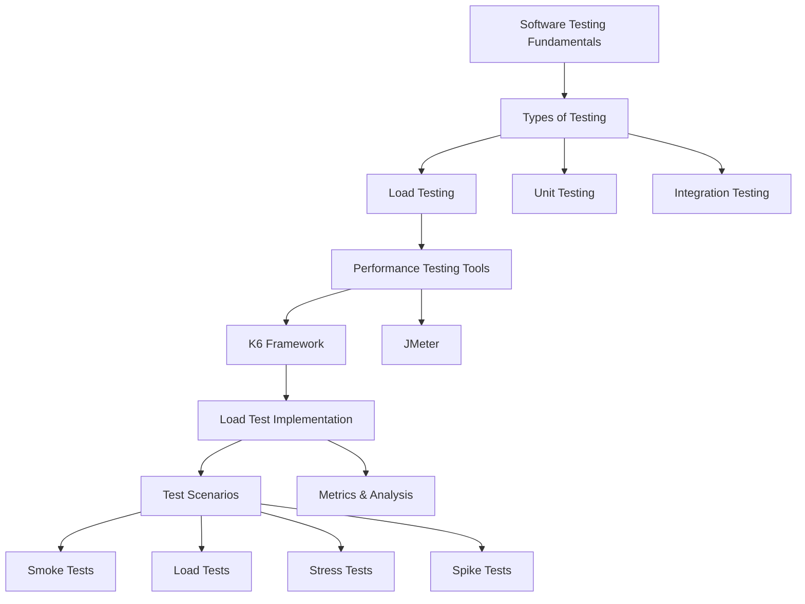

# Performance Testing with K6 and Node.js
This syllabus outlines a practical course on performance testing using K6 and Node.js. The content is designed to provide hands-on experience with modern load testing tools and practices.

## Course Structure Diagram

## Prerequisites
- Basic JavaScript knowledge
- Understanding of HTTP/REST APIs
- Node.js fundamentals
- Command-line interface familiarity

## Course Overview
This course focuses on performance testing using modern tools, with emphasis on K6 and Node.js. Students will learn to design, implement, and analyze load tests for web applications.

## Course Objectives
By the end of this course, students will be able to:
- Understand performance testing concepts and methodologies
- Design and implement load tests using K6
- Analyze and interpret performance metrics
- Create realistic test scenarios
- Debug and optimize performance issues
- Generate and interpret test reports

## Course Outline

### Topic 1: Introduction to Performance Testing
- What is performance testing?
- Types of performance tests
- Key performance metrics
- Testing methodologies

### Topic 2: K6 Framework Fundamentals
- K6 architecture and concepts
- Setting up the testing environment
- Basic test structure
- Running tests

### Topic 3: Writing Load Tests
- Test script structure
- Virtual Users (VUs)
- Checks and thresholds
- HTTP requests and responses

### Topic 4: Advanced Testing Scenarios
- Load test patterns
- Test data management
- Error handling
- Performance thresholds

### Topic 5: Metrics and Analysis
- Understanding metrics
- Response time analysis
- Error rate analysis
- Resource utilization

## Course Content

### Key Topics
1. Performance Testing Fundamentals
2. K6 Framework
3. Test Script Development
4. Test Execution and Monitoring
5. Results Analysis
6. Best Practices

### Course Materials
- K6 documentation
- Sample test scripts
- Practice exercises
- Case studies
- Performance testing templates

### Key Concepts
- Virtual Users (VUs)
- Response Time
- Throughput
- Error Rate
- Test Scenarios
- Performance Metrics
- Load Patterns
- Resource Monitoring

## Resources
- [K6 Official Documentation](https://k6.io/docs/)
- [Web Performance Testing Guide](https://web.dev/performance)
- Sample Code Repository

## Learning Outcomes
Students will develop:
1. Technical proficiency in K6
2. Understanding of performance testing concepts
3. Ability to analyze and report results
